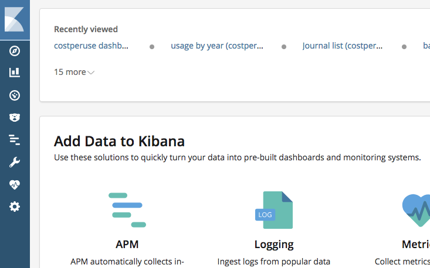

# How to build, test, etc

## Installing the system
__*TBD*__

## Loading the system
__*TBD*__

## Starting the system

* Docker must be running
* Open a terminal window
* Execute these commands to start the system

    ```
    cd ~/Development/Kibana_and_such/projects/2ef82f2698b130ef4a198dcbabac49c7/
    docker-compose start
    ```

* You should see:

    ```
    Starting elk ... done
    ```

### Troubleshooting

* If you see:

    ```
    Starting elk ... 
    
    ERROR: for elk  ('Connection aborted.', FileNotFoundError(2, 'No such file or directory'))
    
    Couldn't connect to Docker daemon. You might need to start Docker for Mac.
    ```

    * Docker is not running. 
    * Start docker from the Applications menu.

## Using the system

* Open a browser window
* Go to `http://localhost:5601/app/kibana`
* You should see: 
* 	the Kibana home page:
	


## Stopping the system

* Open a terminal window
* Execute these commands to start the system

    ```
    cd ~/Development/Kibana_and_such/projects/2ef82f2698b130ef4a198dcbabac49c7/
    docker-compose stop
    ```

* You should see:

    ```
    Stopping 2ef82f2698b130ef4a198dcbabac49c7_elk_1 ... done
    ```

