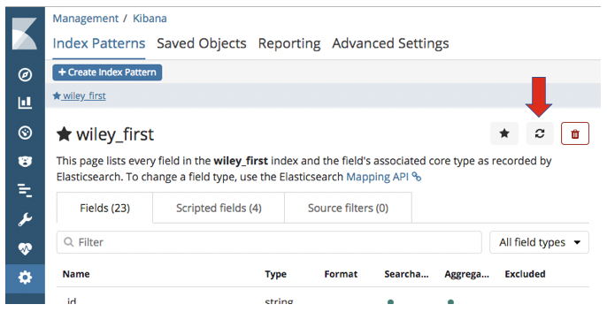

# Development process

## Modify the mapping

* Edit the mapping file. For example, [this one](../mappings/wiley_files/wiley_first.json).
* Pass the mapping to Elasticsearch.
	* *You must drop the index, re-create it, and re-populate it.
		* According to the ["PUT mapping" documentation page][put_mapping_page], 
		  you are not allowed to update an existing field, but I have not be able to add a field either.
	* Run the script: `../scripts/wiley_files/create_wiley_first_index.sh`.
		* This will:
			* delete the existing index
			* create the index again with the revised mapping
			* re-populate the index.
		* It takes about 25 minutes.
* Refresh the field list in Kibana
	* __Rebuilding the Elasticsearch index is not sufficient.__
	* In Kibana: 
		* go to [the `Management` page](http://localhost:5601/app/kibana#/management)
		* open the index pattern that refers to the modified index
		* click the `Refresh field list` button.
		
		  

## Modify the data loader

__*TBD*__

__*Modify the ruby code*__

__*Run the script*__

__*Can run without loading*__

## Change a simple Kibana object

For example, an index pattern, a dashboard, a simple visualization (not VEGA), a stored search.

__*TBD*__

__*Interactively thorugh Kibana*__

__*Export the objects, add to the project*__

## Change a VEGA visualization

__*TBD*__

__*Create the source*__

__*Test the visualization*__

__*Keep the source in the project*__

__*Export the objects, andd to the project*__

[put_mapping_page]: https://www.elastic.co/guide/en/elasticsearch/reference/current/indices-put-mapping.html